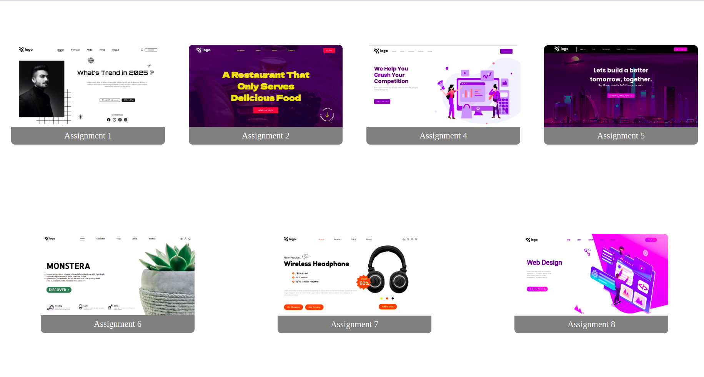

# README cheatsheet

# HEADING 1

## HEADING 2

### HEADING 3

#### HEADING 4

##### HEADING 5

###### HEADING 6

***

**BOLD**
**BOLD**

_ITALIC_

**_BOLD ITALIC_**

~~STRIKE~~

Paragraph

---
### LIST

1.  ONE
2.  TWO
3.  THREE
    1.  ONE
    1.  TWO

- ONE
- TWO
- THREE
  - ONE
  - TWO
---
### LINKS
[LINKS](https://thanushsiva.github.io/assignment-js2022bootcamp "assignments")

---
### CODEBLOCKS
```css
html{
    color:red;
}
```
---
### PRE CODEBLOCKS
<pre>
html{
    color:red;
}
</pre>
---
### KEYWORD
Hello `let` is a keyword

---
### IMAGES

---
### BACKQUOTES
> backquote

> backquote

> backquote
---
### TABLE
| Syntax | Description |
| --- | ----------- |
| Header | Title |
| Paragraph | Text |

---
### HEADING LINK
[heading1](#heading-1)

---
### SUB SUP SCRIPT
H<sub>2</sub>0

X<sup>2</sup>

---
### HIGHLIGHT
I need to highlight these <mark>very important words</mark>.

---
### KEYBOARD
<kbd>thanush</kbd>

---
### CHECKLIST
- [x] done
- [ ]  not done
---

[ReadMe generator](https://rahuldkjain.github.io/gh-profile-readme-generator/) | 
[ReadMe utilities](https://shields.io/)